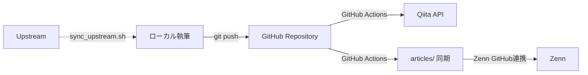
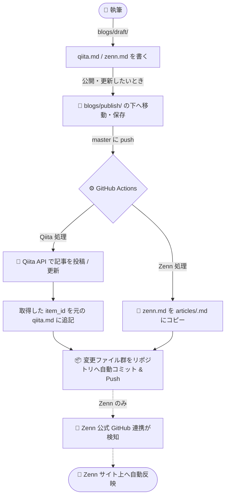
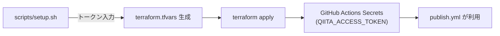

# Architecture

`katana-blogs` のシステム構成と処理フローを記載する。

## Overview

ローカルで Markdown を執筆し、GitHub に push すると Qiita / Zenn へ自動投稿される記事管理基盤。



## Directory Layout

```text
.
├── .github/workflows/publish.yml   # CI/CD ワークフロー
├── articles/                       # CI が自動生成（Zenn 同期用）
├── blogs/
│   ├── draft/                      # 下書き（CI 対象外）
│   │   └── <article-slug>/
│   │       ├── qiita.md
│   │       └── zenn.md
│   └── publish/                    # 投稿対象
│       └── <article-slug>/
│           ├── qiita.md
│           └── zenn.md
├── infra/github/                   # Terraform (GitHub Secrets 管理)
│   ├── main.tf
│   └── variables.tf
├── scripts/
│   ├── setup.sh                    # 初期セットアップ
│   └── publish_articles.py         # 記事投稿エンジン
├── tests/
│   └── test_publish_articles.py
├── requirements.txt
└── package.json
```

## Article Format

各記事は frontmatter でメタデータを持つ。

### Qiita (`blogs/{draft,publish}/<article>/qiita.md`)

```md
---
title: 記事タイトル
tags:
  - python
  - github-actions
private: false
tweet: false
slide: false
item_id:
---

# 本文
```

- `item_id` が空 → 新規作成、値あり → 更新

### Zenn (`blogs/{draft,publish}/<article>/zenn.md`)

```md
---
title: "記事タイトル"
emoji: "⚔️"
type: "tech"
topics: ["python", "github-actions"]
published: true
---

# 本文
```

## 処理フロー

### 投稿パイプライン



### Terraform による Secrets 管理



## 記事ライフサイクル

| 状態 | 配置先 | CI 動作 |
| --- | --- | --- |
| 執筆中（下書き） | `blogs/draft/<article>/` | 投稿対象外 |
| 公開・更新 | `blogs/publish/<article>/` | Qiita API 投稿 + articles/ 同期 |
| 修正 | `blogs/publish/<article>/` を直接編集 | 再投稿・再同期 |

- 一度 `blogs/publish/` に移動した記事は、以降もそのフォルダ内で管理し続ける
- `articles/` は CI が自動生成するディレクトリ。手動編集は不要
